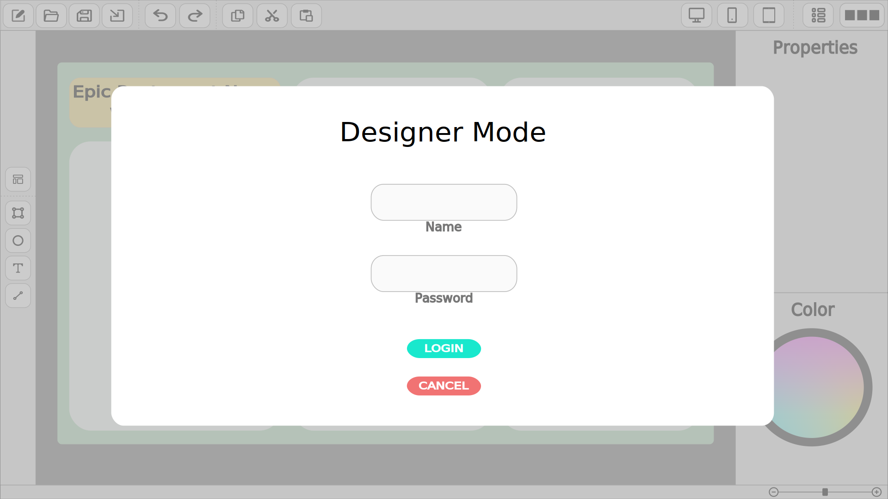
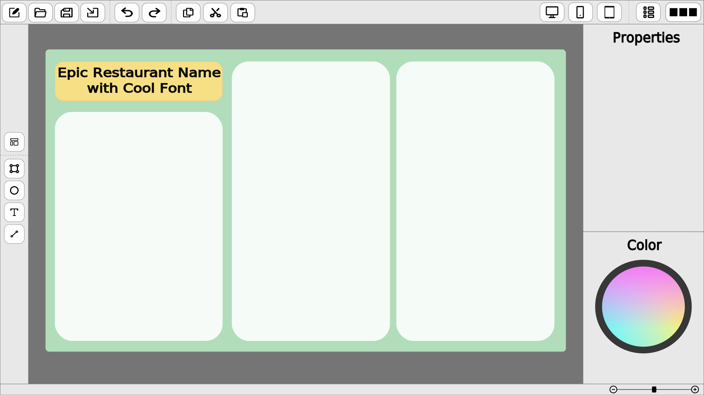
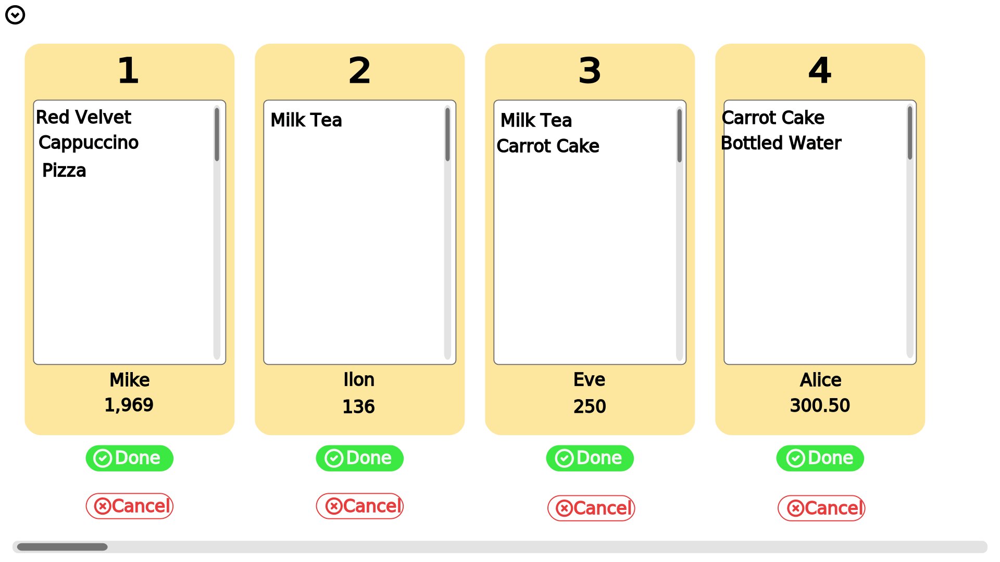
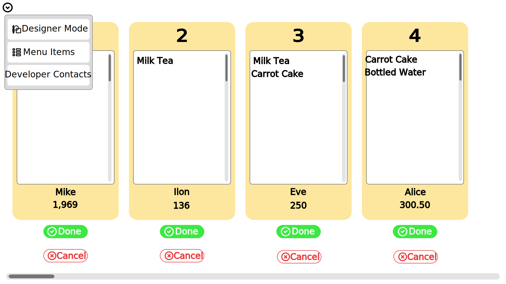
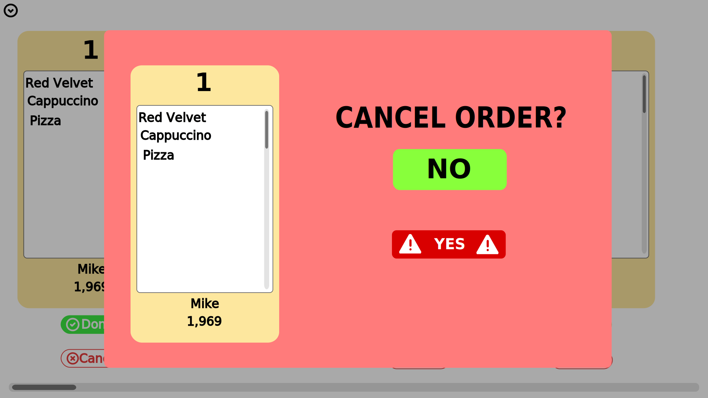
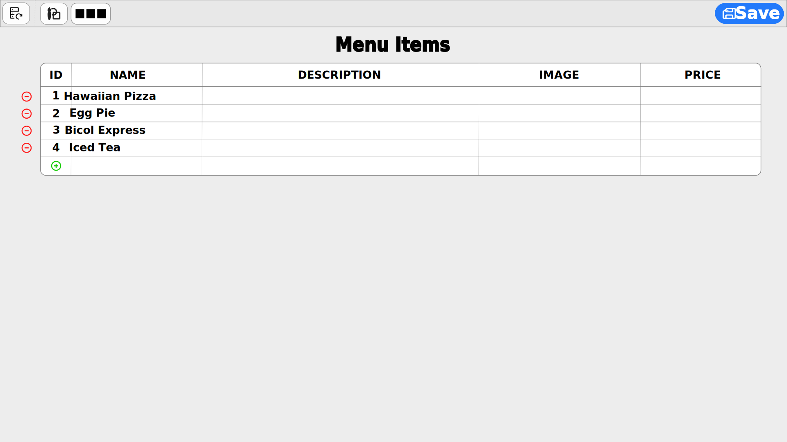
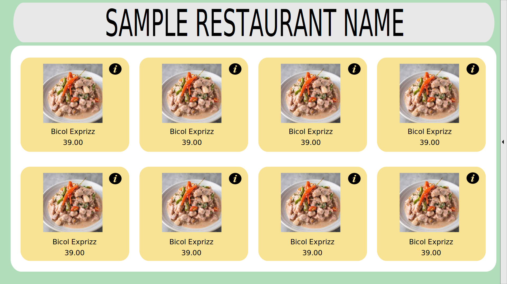
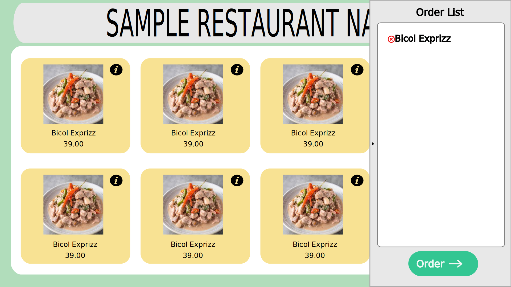

# FreEzMenu
## A Customizable User Interface Menu Application System for Food Service Industry
Initial Client or Target Market (**Within Albay**):
* Local Restaurants
* Cafe shops
* Bars

<br>

## Prototype Design
**Designer Mode**



<br>

**Queue Mode**




<br>

**List Mode**


<br>

**Order Mode**



<br>

## Documents (Google Docs)
* [Draft Proposal](https://docs.google.com/document/d/1bcWLtB48ArufUy17uFiYptRV_mNLCcvPdWxIZq7_ODg)
* [Chapter 1-3](https://docs.google.com/document/d/1CyBjLKHEu7aeKQseCP-78buyEQsO7A2Cv2dc6O0QlFk)
* [Review of Related Literature](https://docs.google.com/spreadsheets/d/15QQ7l_zyVy3mq8g3UHZ5sUtpZxLHcF7hvuwUmwKs988)
* [Gantt Chart](https://docs.google.com/spreadsheets/d/1JkQk4EXdKY6eEB7bOFQpEsZL3rXmWnMvGPKvxSgIHUA)
* [Kanban Board](https://docs.google.com/spreadsheets/d/1yw8BZZ5ZplD2GP6rAilWutbPJZLeB85U0xRRzcVIiGg)
* [Survey Questionnaire](https://docs.google.com/document/d/1LyAaKLMv8iOGfkNaVWNHyk7oibZe6nA1IUUkC7MIv3c)

<br>

## Members:
* Gomez, Algilbert ([alexxShandsome](https://github.com/alexxShandsome))
* Mojar, Justine ([justinemedinamojar01](https://github.com/justinemedinamojar01))
* Ortega, Ben Androz ([benandroz](https://github.com/benandroz))
* Seva, Kenneth ([kennethseva](https://github.com/kennethseva))

**Contact us:**
* ```algilberttibi.gomez@bicol-u.edu.ph```
* ```justineiancarlosmedina.mojar@bicol-u.edu.ph```
* ```benandroz.ortega@bicol-u.edu.ph```
* ```kennethbinalla.seva@bicol-u.edu.ph```

<br>
