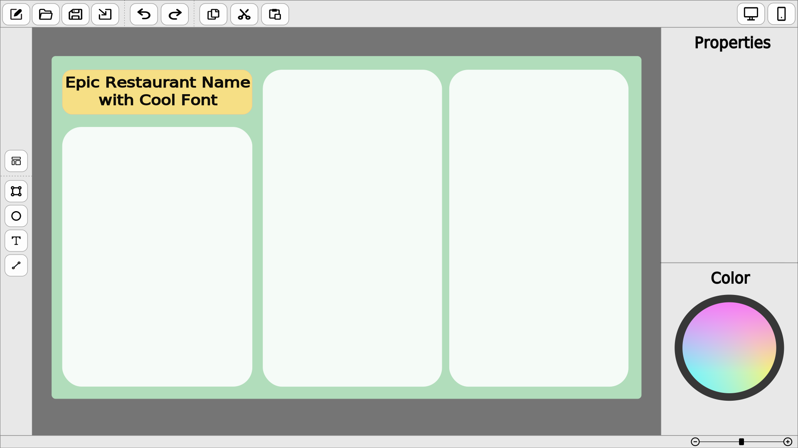

# FreEzMenu
## A Customizable UI, Free and Open-source Menu Application System for Foodservice Industry
Initial Client or Target Market (**Within Albay**):
* Local Restaurants
* Cafe shops
* Bars

<br>

## Prototype Design
**"Designer"** Version


<br>

**"Order"** Version


<br>

## Documents (Google Docs)
* [Draft Proposal](https://docs.google.com/document/d/1bcWLtB48ArufUy17uFiYptRV_mNLCcvPdWxIZq7_ODg)
* [Chapter 1-3](https://docs.google.com/document/d/1CyBjLKHEu7aeKQseCP-78buyEQsO7A2Cv2dc6O0QlFk)
* [Review of Related Literature](https://docs.google.com/spreadsheets/d/15QQ7l_zyVy3mq8g3UHZ5sUtpZxLHcF7hvuwUmwKs988)
* [Gantt Chart](https://docs.google.com/spreadsheets/d/1JkQk4EXdKY6eEB7bOFQpEsZL3rXmWnMvGPKvxSgIHUA)

<br>

## Members:
* Gomez, Algilbert ([alexxShandsome](https://github.com/alexxShandsome))
* Mojar, Justine ([justinemedinamojar01](https://github.com/justinemedinamojar01))
* Ortega, Ben Androz ([benandroz](https://github.com/benandroz))
* Seva, Kenneth ([kennethseva](https://github.com/kennethseva))

**Contact us:**
* ```algilberttibi.gomez@bicol-u.edu.ph```
* ```justineiancarlosmedina.mojar@bicol-u.edu.ph```
* ```kennethbinalla.seva@bicol-u.edu.ph```

<br>

## Idea/s or Keywords:
* Digital Menu
* Foodservice Industry
* Free and Open Source
* Generic
* Customizable UI Menu System

## Scope and Delimitations:
* FOSS tools only
* For Albay provice in the meanwhile
* No integration for self service kiosk
* Devices shall be only connected through LAN or WLAN
* No online or cloud services
* Designing the digital menu can only be done using Laptops or PCs only
* No generation and tracking of receipts

<br>
